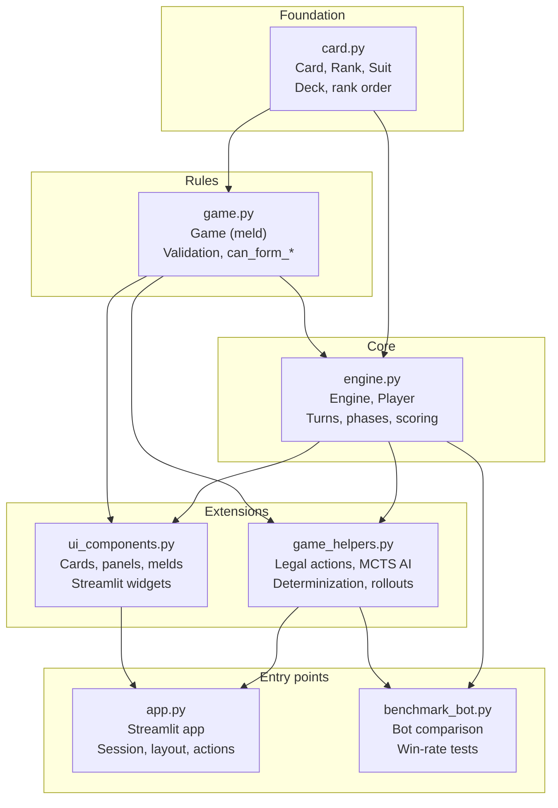

# Brazilian Canastra

A Brazilian Canastra card game implemented in Python with a Streamlit interface.

## How to run

```bash
python main.py
```

Or run Streamlit directly:

```bash
streamlit run app.py
```

---

## Game rules

### Definitions

- **MELDS**: Three or more cards of the same suit in sequence (Ace can be before 2 or after King).
- **TRIPLE**: Three or more cards of the same rank (wildcards allowed).
- **WILDCARD**: The 2 substitutes any card. Each meld may contain at most one wildcard.
- **STOCK**: Remaining cards after the deal.
- **DEAD HAND (morto)**: Two piles of 11 cards, one per team, given to the player who first empties their hand.
- **DISCARD PILE**: Discarded cards, all visible.
- **CANASTRA**: A meld of 7+ cards:
  - **Clean**: No wildcards
  - **Dirty**: With wildcard(s)

### Actions

- **DRAW**: Draw one card from the stock or take the entire discard pile.
- **LAY DOWN**: Place a new meld on the table.
- **KNOCK**: When the hand is empty:
  - **Direct**: Last card was laid; player takes the dead hand.
  - **Indirect**: Last card was discarded; player takes the dead hand on their next turn.
  - **Final**: Ends the game (requires a clean canastra to go out).

### Scoring

- Final knock: +100
- Per card in melds: 10 points each
- Dirty canastra: +100
- Clean canastra: +200
- Never taking the dead hand: -100
- Cards left in hand: count as negative points

---

## Code organization

The project is split into layers: **data and rules** at the bottom, **game state and flow** in the middle, then **AI/simulation** and **UI**, and finally the **app** that ties everything together.

### Architecture diagram



### Module roles

| Module | Role |
|--------|------|
| **card.py** | Card representation (`Card`, `Rank`, `Suit`), full deck creation (`create_canastra_deck()`), and canonical rank order for sequences. No dependency on game or engine. |
| **game.py** | Meld model and rules: `Game` (sequence or triple), validation, `can_form_sequence` / `can_form_triple`, and wildcard-in-sequence rule. Depends only on `card`. |
| **engine.py** | Game state and flow: `Engine`, `Player`, turn phases (draw → lay down → discard), drawing, laying down, discarding, knock handling, and scoring. Depends on `card` and `game`. |
| **game_helpers.py** | AI and simulation: legal and abstract action enumeration, applying actions on a clone, determinization (for hidden cards), MCTS/rollouts, “bot suggestion”, and helpers like `detect_game_type`, `find_valid_game`, `organize_hand`. Used by the app and by `benchmark_bot`. Depends on `card`, `engine`, and `game`. |
| **ui_components.py** | Reusable Streamlit UI: card display, face-down cards, player panels, meld areas, sorting cards for display, app CSS. Depends on `card`, `engine`, and `game`. |
| **app.py** | Streamlit application: session state, layout (sidebar, table, hand, actions), phase-specific rendering (draw, lay down, discard), and wiring to the engine and game helpers. Depends on `card`, `engine`, `game`, `game_helpers`, and `ui_components`. |
| **main.py** | Entry point: runs `streamlit run app.py`. |
| **benchmark_bot.py** | Benchmarks and bot comparison (e.g. control vs challenger, win rate). Depends on `engine` and `game_helpers`. |

### Data flow (simplified)

1. **User action** (e.g. “Draw from stock”) → **app.py** handles the widget and calls **engine** (e.g. `engine.draw_from_stock()`).
2. **Engine** updates state (hands, stock, phase) and may log messages.
3. **App** re-renders by reading `engine` and building the page with **ui_components** (cards, panels, melds).
4. When it’s the AI’s turn, **app** calls **game_helpers.play_ai_turn(engine)**; the helper uses legal actions, MCTS/rollouts, and **engine** methods to perform the turn.

---

## Interface

The Streamlit UI lets you:

- View and select cards in your hand
- Draw from the stock or the discard pile
- Lay down sequences or triples
- Add cards to existing melds
- Discard a card
- See the game log and other players’ status (e.g. card counts)


---

## Project structure

```
canastra/
├── __init__.py          # Package exports (Card, Engine, Game, …)
├── card.py              # Cards, deck, rank order
├── game.py              # Melds and rules
├── engine.py            # Game state and flow
├── game_helpers.py      # AI, legal actions, simulation
├── ui_components.py     # Streamlit UI building blocks
├── app.py               # Streamlit app (orchestrator)
├── main.py              # Entry point (runs streamlit run app.py)
├── benchmark_bot.py     # Bot benchmarks and comparison
├── requirements.txt    # Dependencies for deploy
├── pyproject.toml       # Project and test config
├── README.md
└── tests/
    ├── __init__.py
    └── test_integration.py
```
